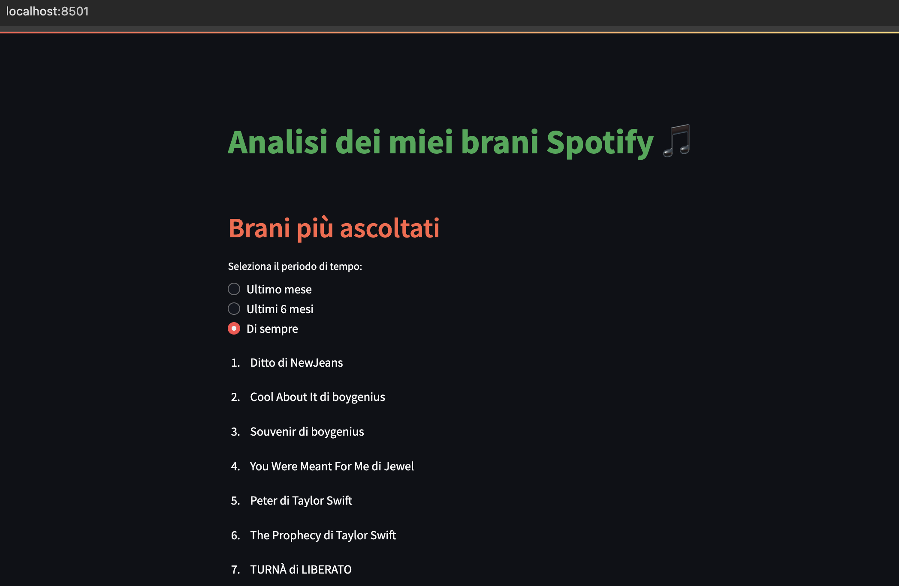
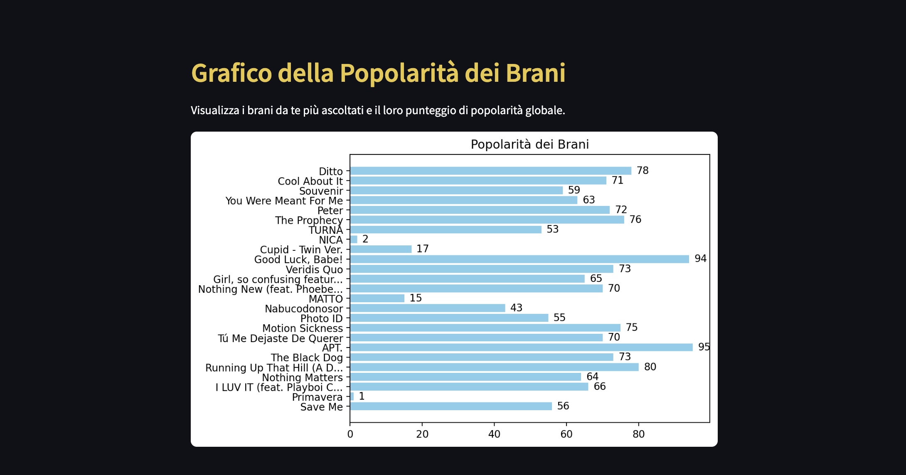

# Analisi Spotify 🎵
Un progetto Python per analizzare i brani più ascoltati su Spotify usando Spotipy e Streamlit.

## 📊 Esempio di Interfaccia
Ecco alcuni esempi dell'app in azione:

### Brani più ascoltati

### Grafico della popolarità

## Prerequisiti
- [Python 3.9+](https://www.python.org/downloads/)
- Le librerie elencate in `requirements.txt`
- Un account Spotify Developer con un'app registrata.
  
## Come eseguire
1. Clona il repository: `git clone https://github.com/giuli4lr/AnalisiSpotify.git`
2. Installa i requisiti: `pip install -r requirements.txt`
3. Avvia Streamlit: `streamlit run main.py`

## Funzionalità
- Visualizzazione dei brani più ascoltati (1 mese, 6 mesi, di sempre).
- Grafici sulla popolarità dei brani e degli artisti.
- Grafici sui generi più ascoltati.
